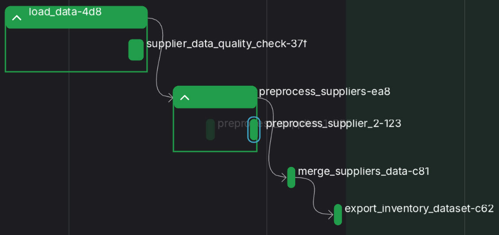

# Supplier Data Processing

## Overview
This script processes inventory data from two suppliers by:

- Standardizing column names and categorical values
- Handling missing data
- Merging the datasets into a single, cleaned inventory dataset

The resulting dataset is ready for analysis or machine learning applications.

## Assumptions
- Each Excel file contains **exactly one sheet**.
- Descriptions and finishes are manually mapped to standardized English terms.
- `quality_choice` values are converted to **uppercase**.
- Unnecessary columns (`rp02`, `rm`, `ag`, `ai`) are removed.
- Missing categorical values are filled with `"UNKNOWN"`; numerical values are left unchanged unless required for ML.
- Unique `article_id`s are generated for Supplier 1.

## Workflow (Implemented with Prefect Pipeline)

The data processing workflow is orchestrated using **Prefect**, ensuring modularity and easy scheduling.

### 1. Load Data
- Ensure Excel files have a single sheet.
- Load the files into Pandas DataFrames.
- Perform an initial data quality check.

### 2. Preprocess Data

#### Supplier 1
Tasks performed:
- Standardize column names
- Map `description` and `finish` values to consistent categories
- Convert `quality_choice` to uppercase
- Rename columns for consistency
- Add `source` column and generate `article_id` UUIDs
- Drop unnecessary columns (`rp02`, `rm`, `ag`, `ai`)

#### Supplier 2
Tasks performed:
- Standardize column names
- Map `description` values to `finish` categories
- Rename columns for consistency
- Add `source` column

### 3. Merge Datasets
- Ensure column names are consistent across datasets
- Generate `article_id`s for Supplier 1
- Remove unwanted columns
- Concatenate both suppliers into `inventory_dataset`
- Handle missing values in the merged dataset

### 4. Export
- Save the cleaned dataset as a CSV file
