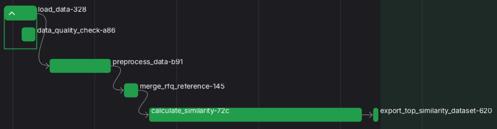
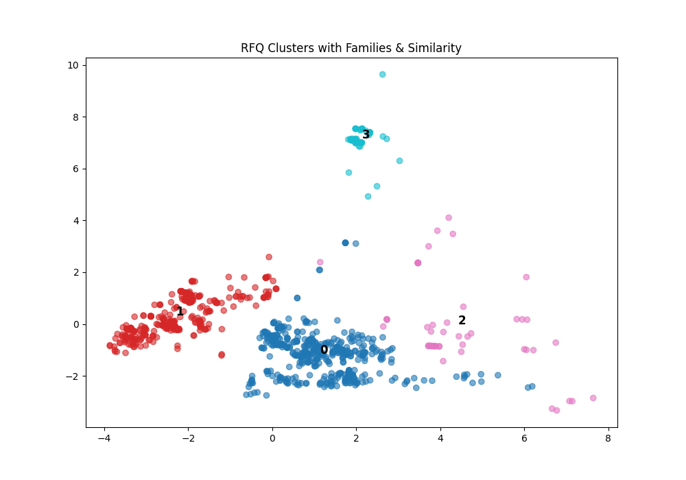
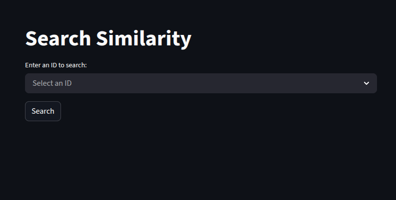

# RFQ–Reference Matching

## Overview
This project focused on **cleaning, standardizing, and merging RFQ data (`rfq.csv`) with reference material properties (`reference_properties.tsv`)**, followed by building a **similarity framework** to match and cluster RFQs.

Additionally, a **Streamlit app** was created to interactively explore RFQ similarity.


## Assumptions
- `UNS_No` and `Steel_No` are fully missing → kept as-is (future: external lookups).
- Missing `grade` values filled with `"UNKNOWN"` or inferred from duplicates.
- Grades normalized (uppercase, no spaces, suffix extracted).
- Categorical values standardized (e.g., `"OILED"` → `"OILED (O)"`).
- Missing values handled systematically:
  - categorical → `"UNKNOWN"`
  - numeric → mean imputation
  - ranges → `(min, max)` extraction
- Left-join on `grade`, with RFQ data taking priority.


## Workflow (Implemented with Prefect Pipeline)

The data processing workflow is orchestrated using **Prefect**, ensuring modularity and easy scheduling.




### 1. Data Cleaning
- Standardized column names, normalized grades, dropped duplicates.
- Parsed ranges like `"5-10"` or `"<20%"` into numerical min/max.
- Removed columns with excessive missingness (>90%).

### 2. Feature Engineering
- Extracted grade suffixes and mapped them to finishes.
- Created mid-point features for mechanical properties (`yield`, `tensile`, `elongation`).

### 3. Similarity Framework
- **Dimensional**: IoU or Overlap for numeric ranges.
- **Categorical**: Partial, Exact, or Jaccard match.
- **Grade-based**: Cosine similarity on mechanical property vectors.
- Aggregate similarity = weighted combination of all components.

### 4. Matching & Export
- Top-3 matches generated per RFQ.
- Results saved as `top3.csv`.

### 5. Ablation & Clustering
- Ablation tested weighting strategies (dims-only, cats-only, grades-only, full mix).
- KMeans clustering (k=4) revealed interpretable RFQ families.
- PCA visualization highlighted cluster separation.


## Insights
- Grade normalization was essential for consistent merging.
- Mixed-weight models (dims + cats + grades) gave the most stable similarity results.
- Clustering highlighted distinct RFQ groups with clear shared specifications.




## Future Work

- **External Grade Mapping**: Enrich UNS/Steel numbers using trusted material databases.
- **NLP & LLM Extraction**: Extract structured features from RFQ descriptions and supplier files, with automatic translation to English.
- **Advanced Imputation**: Predict missing mechanical values using machine learning.
- **Similarity Tracking**: Track performance of different similarity measures with MLflow.
- **Expanded Data & Automation**: Scrape additional reference data, auto-detect file formats, and correct minor input differences using fuzzy matching.
- **End-to-End Matching**: Recommend potential suppliers (Task 1) for each RFQ (Task 2) based on similarity scores.


## Streamlit App

A **Streamlit app** was created to explore RFQ similarity interactively.

**To run the app:**
```bash
streamlit run app.py
```
You can also try the online version of the app on [Streamlit Cloud](https://rfq-similarity.streamlit.app/).

The app could show more features, but is limited since the data stays offline for privacy.


